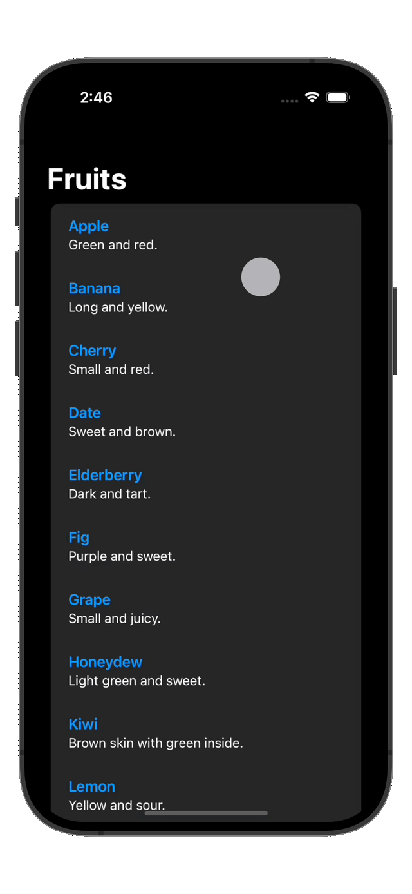

# Generic Searchable SwiftUI View

### SearchView

This proof of concept demonstrates how to natively implement a generic `SearchView` using Swift & SwiftUI APIs. The project was initiated in response to a request from the [Swift() Telegram Group](https://t.me/SwiftGroup).

### Example Projects

[Explore detailed examples here](https://github.com/cs4alhaider/SearchViewExamples) on using `SearchView` in these sample applications:

| Example Country search app | Example Frutes search app |
| -------------------------- | ------------------------- |
|  |  |

---
## Understanding `SearchView`: An In-Depth Guide

The `SearchView` struct in Swift offers a versatile and customizable search interface for SwiftUI applications. This guide explores its components, functionality, and how to effectively integrate it into your projects.

### Core Concepts

#### Generic Structure
`SearchView` is designed with a generic structure to offer flexibility, defined by:
- `Item`: A data model conforming to `Searchable`, which includes identifiable and hashable objects.
- `Content`: The view type for displaying each item in the search results.
- `Value`: The type of searchable properties within `Item`, which must be hashable.

#### Main Features
- **Dynamic Search**: Dynamically updates the display based on user input and searchable properties.
- **Recent Searches**: Manages and displays recent searches using `UserDefaults`.
- **Customizable UI**: Offers customization of text elements through `SearchViewConfiguration`.

### How It Works

#### Initialization
To initialize `SearchView`, you'll need:
- An array of `Item` objects to search through.
- KeyPaths to the searchable properties within `Item`.
- A binding to a `String` that represents the current search query.
- A closure (`content`) defining the display of each `Item`.

#### Search Functionality
- Filters items based on the search query and specified searchable properties.
- Provides real-time display updates as the user types.

#### Recent Searches
- Saves recent searches to `UserDefaults` and displays them when the search field is focused but empty.
- Includes functionality to clear recent searches easily.

#### Customization
- `SearchViewConfiguration` allows for the customization of prompts, empty and no-result state messages, and more for a tailored user experience.

### Usage Example

Define your data model and conform to `Searchable`.

```swift
struct MyDataItem: Searchable {
    var id: UUID
    var name: String
}

struct Fruit: Searchable {
    var id: UUID = UUID()
    var name: String
    var description: String

    var idStringValue: String {
        id.uuidString
    }
}
```

Create example arrays to use in the demo:

```swift
let dataList = [
    MyDataItem(id: UUID(), name: "Item 1"),
    MyDataItem(id: UUID(), name: "Item 2"),
]

extension Fruit {
    static var example: [Fruit] {
        [
            Fruit(name: "Apple", description: "Green and red."),
            Fruit(name: "Banana", description: "Long and yellow."),
            // Add more fruits...
        ]
    }
}
```

Implement `SearchView` in your SwiftUI view:

```swift
@State private var searchQuery: String = ""

var body: some View {
    NavigationStack {
        SearchView(items: dataList,
                   searchableProperties: [\MyDataItem.name],
                   searchQuery: $searchQuery) { item, query in
            Text(item.name)
        }
        SearchView(
            items: Fruit.example,
            searchableProperties: [\.name, \.description],
            searchQuery: $searchQuery
        ) { fruit, searchTerm in
            VStack(alignment: .leading) {
                Text(fruit.name).bold().foregroundColor(.blue)
                Text(fruit.description).font(.subheadline)
            }
            .padding(.vertical, 4)
        }
        .navigationTitle("Searchable Items")
    }
}
```

## Installation

Requires iOS 17 and Xcode 15 or later.

1. In Xcode, navigate to `File -> Swift Packages -> Add Package Dependency`.
2. Paste the repository URL: `https://github.com/cs4alhaider/SearchView`.
3. Select the `master` branch or a specific version.

## Author

[Abdullah Alhaider](https://x.com/cs4alhaider), cs.alhaider@gmail.com

## License

This project is licensed under the MIT License - see the [LICENSE](LICENSE) file for details.
