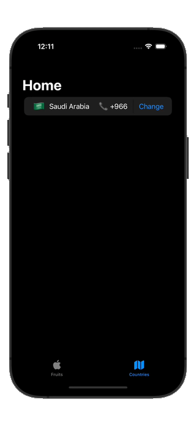

# Searchable SwiftUI View

### SPM, Prove of concept on how to natively implement SearchView using SwiftUI API's

This POC was requested from [let groupe = Swift()](https://t.me/SwiftGroup) Telegram channel.

## Example projects 
Here you can see in details two examples on how to use `SearchView`, go to [this repo](https://github.com/cs4alhaider/SearchViewExamples)

| Example Country search app | Example Frutes search app |
| -------------------------- | ------------------------- |
|  |  |

---

- [Installation](#installation)
- [Usage](#usage)
- [Author](#author)
- [License](#license)

## Installation

> It requires iOS 17 and Xcode 15!

In Xcode go to `File -> Swift Packages -> Add Package Dependency` and paste in the repo's url: `https://github.com/cs4alhaider/SearchView` and use `master` branch

## Usage

```swift
import SearchView
```

Define your data model and conform to `Searchable` like:

```swift
struct Fruit: Searchable {
    var id: UUID = UUID()
    var name: String
    var description: String

    var idStringValue: String {
        id.uuidString
    }
}
```

For this demo purpose, will create `[Fruit]` example to play around:

```swift
extension Fruit {
    public static var example: [Fruit] {
        [
            Fruit(name: "Apple", description: "Green and red."),
            Fruit(name: "Banana", description: "Long and yellow."),
            ...
        ]
    }
}
```

And then add it and everything should work:

```swift
struct ContentView: View {
    @State private var searchQuery = ""
    let fruits: [Fruit] = Fruit.example

    var body: some View {
        NavigationStack {
            SearchView(
                items: fruits,
                searchableProperties: [\.name, \.description],
                searchQuery: $searchQuery
            ) { fruit, searchTerm in
                VStack(alignment: .leading) {
                    Text(fruit.name)
                        .bold()
                        .foregroundColor(.blue)
                    Text(fruit.description)
                        .font(.subheadline)
                }
                .padding(.vertical, 4)
            }
            .navigationTitle("Fruits")
        }
    }
}

```

## Author

[Abdullah Alhaider](https://x.com/cs4alhaider), cs.alhaider@gmail.com

## License

This project is under the MIT license. See the LICENSE file for more info.
